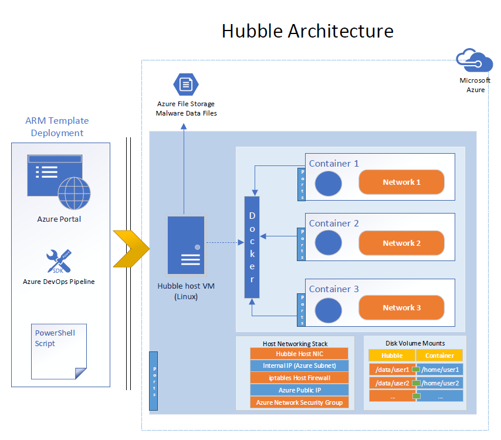

# sandbox
An automatic Security Sandbox environment for malware testing

Please reference my [Blog Post](https://www.linkedin.com/pulse/single-click-security-sandbox-deployment-using-docker-jackson?lipi=urn%3Ali%3Apage%3Ad_flagship3_profile_view_base_recent_activity_details_all%3Be2A2HUlkSleoKjGLq1%2BWBg%3D%3D&licu=urn%3Ali%3Acontrol%3Ad_flagship3_profile_view_base_recent_activity_details_all-update_article_image) as I walkthrough the project.

# Architecture

